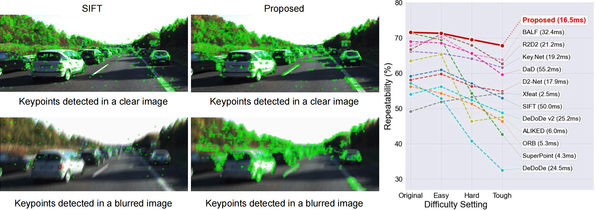

# RLFDB: Robust Local Feature Detection in Blurred Images

<div align="center">


**A robust local feature detection method for blurred images**

</div>


## 📖 Introduction
Local feature detection is fundamental for tasks such as image stitching, localization, and 3D reconstruction. However, the performance of existing methods severely degrades when processing real-world images that exhibit various types and degrees of blur. To address this challenge, we introduce the first local keypoint detector that leverages a Mixture-of-Experts (MoE) model, significantly enhancing its robustness across diverse blur conditions as well as on clear images. Our detector employs an MoE-based decoder that is jointly trained on both clear and diversely blurred images. It adaptively selects the optimal expert through a hard routing mechanism to adjust to varying image conditions. Furthermore, we employ various techniques to reduce the network's texture bias, which further improves its robustness to blurred images. Extensive experiments demonstrate that our detector achieves state-of-the-art performance on both clear and various types of blurred images, providing a general and real-time solution for challenging visual environments.
<div align="center">

<p><em>Figure 1: Comparison of feature detection performance between traditional methods and our RLFDB approach across different blur conditions. Our method maintains consistent detection quality while existing methods degrade significantly in blurred scenarios.</em></p>
</div>

## ✨ Features

- **🎯 Robust Detection**: Maintains high repeatability in various blur conditions
- **🚀 Real-time Performance**: Optimized network architecture for fast inference
- **🔧 Easy Integration**: Simple APIs for both training and inference
- **⚡ Multi-GPU Support**: Distributed training on multiple GPUs

## 🔧 Installation

### Prerequisites

- Python 3.8 or higher
- PyTorch 1.8 or higher
- CUDA 11.8+ (recommended for GPU acceleration)
- 8GB+ GPU memory (for training)

### Quick Installation

```bash
# Clone the repository
git clone https://github.com/Xinzhe99/RLFDB.git
cd RLFDB

# Create conda environment (recommended)
conda create -n rlfdb python=3.8
conda activate rlfdb

# Install PyTorch (adjust CUDA version as needed)
pip install torch torchvision torchaudio --index-url https://download.pytorch.org/whl/cu118

# Install other dependencies
pip install -r requirements.txt
```


## 🚀 Quick Start

### Download [Pretrained Models](https://pan.baidu.com/s/1fxlTjq2hRv6Y_XPOoR1qHA?pwd=cite)

```bash
# Create pretrained directory
mkdir pretrained

# Download pretrained weights (replace with actual download link)
wget -O pretrained/checkpoint.pth
```

### Simple Inference

```bash
# Run inference on a single image
python demo_inference.py \
    --ckpt_file pretrained/checkpoint.pth \
    --input_image assets/kitti_selected_motion_blur_median.png \
    --output_image results/output.png
```

### Feature Matching Demo

```bash
# Run feature matching between two images
python demo_match_proposed.py \
    --image_path1 assets/mffw_06_A.jpg \
    --image_path2 assets/mffw_06_B.jpg \
    --output_path results/matching_result.jpg
```

## 💻 Usage

### Python API

```python
import torch
import numpy as np
from PIL import Image
from model.network import RLFDB
from demo_inference import load_im, detect_and_save, parse_test_config

# Initialize model
device = torch.device('cuda' if torch.cuda.is_available() else 'cpu')
model = RLFDB(
    dims=[32, 64, 128, 256], 
    layers=[2, 2, 6, 2], 
    expand_ratio=3.0, 
    mlp_ratio=3.0, 
    use_dw=True,
    drop_path_rate=0.05
).to(device)

# Load pretrained weights
checkpoint = torch.load('pretrained/checkpoint.pth', map_location=device)
model.load_state_dict(checkpoint['model_state'])
model.eval()

# Detect keypoints
args = parse_test_config()
image = load_im('path/to/your/image.jpg')
keypoints = detect_and_save(args, image, model, device)

print(f"Detected {len(keypoints)} keypoints")
# keypoints format: [x, y, score, response] for each point
```

## 📊 Dataset

### Data Preparation (For training)
All the datasets you need can be downloaded from this [link](https://pan.baidu.com/s/19V-JSJ1iHSEPctzpUo9o3w?pwd=cite).
The GOPRO dataset is used for training and the Hpatch-sequence dataset is used for evaluation.

```bash
# Create dataset directory
mkdir -p data

# GOPRO dataset structure
data/
├── GOPRO_Large/
│   ├── train/
│   │   ├── GOPR0884_11_00
│   │   ├── ...
│   │   └── ...
│   ├── test
── GOPRO_raw_ground_truth_more_points/
```

### Dataset Configuration (For training)

Update the dataset paths in `configs/gopro_train_detection.yaml`:

```yaml
data:
    GOPRO_ours:
    images_path: /path/to/GOPRO_Large
    sequences_split_path: /datasets/GOPRO_sequences_split_ours
    labels_path: /path/to/GOPRO_raw_ground_truth_more_points
    patch_size: 256
```

## 🏋️ Training

### Start Training
Realted settings are in configs/config.py
```
python train.py
```

## 📈 Evaluation

We have created a toolbox for evaluation, which is in preparation, so stay tuned

## 📝 Citation

If you find this work useful in your research, please consider citing:

```bibtex
@article{xinzhe2024rlfdb,
  title={Robust Local Feature Detection in Blurred Images},
  author={xxxx},
  journal={xxxxxx},
  year={2025}
}
```

## 📄 License

This project is licensed under the MIT License.

## 🙏 Acknowledgments

xxxx

## 📧 Contact

- **Issues**: Please report bugs and feature requests via [GitHub Issues](https://github.com/Xinzhe99/RLFDB/issues)


<div align="center">

⭐ **Star this repository if you find it helpful!** ⭐

**Made with ❤️ by [Xinzhe99](https://github.com/Xinzhe99)**

</div>
